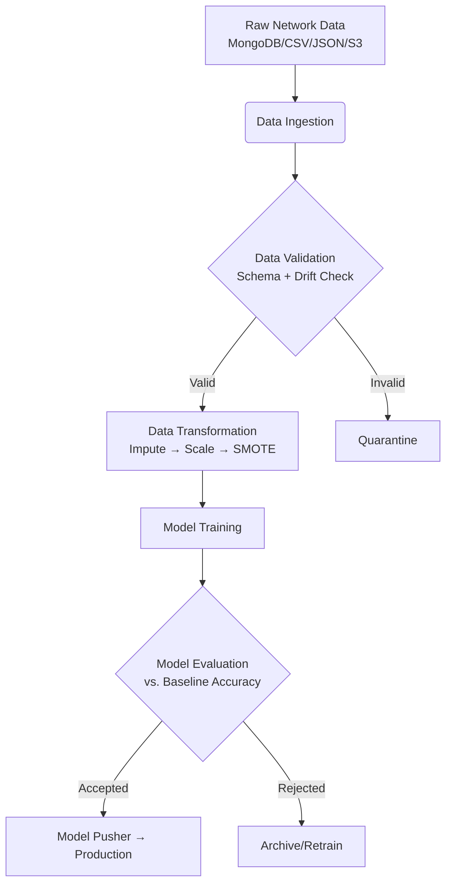

# Network Security Anomaly Detection Pipeline

## Overview

- An automated machine learning pipeline for detecting anomalies/intrusions in network traffic data. The system ingests network logs, validates and transforms features, trains classification models, and deploys accepted models to production.

## Architecture

- A sequential, config-driven pipeline with six core components:

- Data Ingestion → Data Validation → Data Transformation → Model Training → Model Evaluation → Model Pusher

Each component:
- Reads configuration (YAML/JSON)
- Consumes artifacts from the previous stage
- Produces artifacts for the next stage
- Validates inputs/outputs before proceeding

## Pipeline Components

| Component | Responsibilities |
|-----------|------------------|
| **Data Ingestion** | Pulls raw network data from MongoDB, CSV, JSON, AWS S3, MySQL, and APIs. Splits into train/test sets. |
| **Data Validation** | Validates schema compliance, checks for missing columns, detects data drift between train/test sets. |
| **Data Transformation** | Applies preprocessing pipeline: imputation → robust scaling → SMOTE-Tomek (for class imbalance) → saves as NumPy arrays. |
| **Model Trainer** | Trains multiple models using config-defined parameters; selects best performer based on metrics. |
| **Model Evaluation** | Compares best model against baseline accuracy threshold; accepts/rejects for deployment. |
| **Model Pusher** | Saves accepted models (`model.pkl`) and preprocessing artifacts (`preprocessing.pkl`) to production store. |

## Data Flow

## Dataset
Dataset can be downloaded from
https://archive.ics.uci.edu/dataset/327/phishing+websites

## Key Features
- Config-driven: All stages controlled via YAML configs (paths, thresholds, model params)
- Artifact tracking: Each component outputs versioned artifacts (CSVs, .npy, .pkl)
- Drift detection: Monitors feature distribution shifts between train/test sets
- Imbalance handling: SMOTE-Tomek resampling for skewed network attack classes
- Deployment-ready: Final artifacts (model.pkl + preprocessing.pkl) packaged for AWS deployment (Docker/Kubernetes/ECS)

## Deployment Target
Models deployed to AWS infrastructure:
Docker containerization
Kubernetes/ECS orchestration
AWS S3 for artifact storage

## Reference
Sample project from MLOps Bootcamp course by Krish Naik